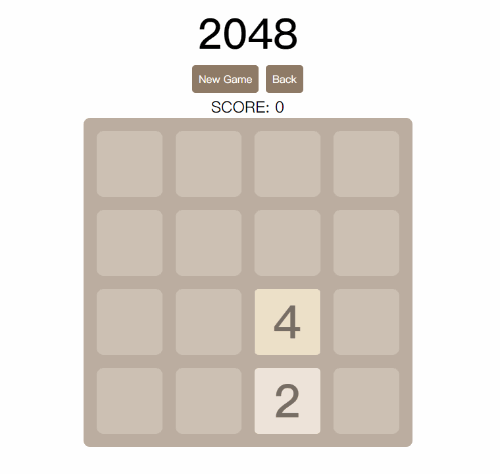
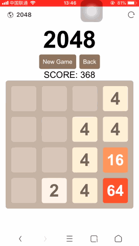
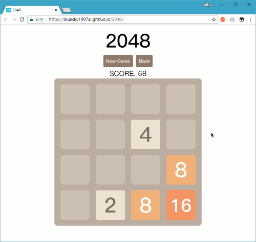

# 2048 - jQuery小游戏

> **预览地址：&#x1F449;** [点击开玩](https://bluesky1997al.github.io/2048/)  
&#x1F447; **或扫描二维码**  


利用课余时间，基于 jQuery 制作的 HTML 小游戏 &#x1F3AE;



> &#x2728; 流畅的体验

## 特征

### &#x1F4F1; 多平台支持

  + 支持PC端，移动端，在多大的屏幕上都能够自适应
  + 支持PC端 WASD，上下左右方向键操作
  + 支持移动端触屏操作



### &#x1F48E; 数据持久化

  + 刷新，退出，浏览器崩溃，手机没电？没关系，重新打开接着玩儿
  + 你所玩儿的每一步，我们都把它记下来，感觉玩儿的不顺心？Back 即可

> 就要做舒心的小游戏 &#x1F496;



> &#x26A0; Tips：我们使用 `localStorage` 记录每一步的网格、分数以及最高分数信息，只要您不清除浏览器网站信息或开始新的游戏，这些信息就可以在下次进入游戏时被调用

### &#x1F680; 体积小，节省流量

  + 我们没有使用一张图片。按钮，网格，方块全部都由 CSS / JS 实现
  + 加载速度快，省流量，仅需 24KB

## 目录结构

```bash
  . 2048
  ├── asset               # README.md 中用到的图像资源
  ├── es5                 # 使用 JavaScript ES5 版本制作的小游戏
  ├── es6                 # 使用 JavaScript ES6 版本制作的小游戏
  ├── server              # Express 静态资源服务器
  ├── .gitignore          # git 忽略文件列表
  ├── package-lock.json   # 包依赖锁文件
  ├── package.json        # 包描述文件
  └── README.md           # 本说明文件
```

## 技术细节

### &#x1F4A1; 大体思路

  + HTML 文件仅由标题，两个基本按钮和空的网格 Container 以及游戏结束提示框组成
  + 页面初始化时：
    - 由 jQuery 循环生成游戏框架网格
    - 对设备分辨率进行适配，使网格、框架大小适配屏幕大小，并使其总宽高不超过 500px
    - 读取 `localStorage`，检查其中是否存在信息。若存在，将已存在的信息渲染出来，否则开始新的游戏
  + 我们使用一个 4x4 的二维数组 board 来映射当前游戏状态，同时用一个 4x4 的二维数组 conflict 来记录每个网格的冲突状态
  + 遍历 board 数组，随机寻找两个位置（为了性能限定查找次数为50次），每次查找位置后判断该位置是否为空，是空则继续生成2或4的随机数，不是则继续寻找随机空白位置。每次生成两个随机数的概率为 2：4 -> 0.8：0.2。每次生成随机数结束后依照 board 数组对界面进行刷新，并将状态存在 `localStorage` 中
  + 监听按键 / 触屏事件：
    - 监听按键事件，绑定 WASD 以及 上下左右方向键 的按下事件，对应触发相应的移动函数
    - 监听触摸 start / move / end 事件，计算移动距离来触发相应的移动函数
  + 移动函数：
    - 首先判定当前状态是否可以移动（遍历 board 数组，判断移动方向上是否有可以合并或空的元素）
    - 如果可以移动，则对 board 数组进行遍历，查找移动方向上的空间和可以合并的元素（合并过后对元素进行锁操作，以防下一元素与已合并元素合并）
    - 每次移动函数结束后依照 board 数组对界面进行刷新，并判断游戏是否获取胜利 / 失败
  + 动画：
    - 使用 jQuery 的 `animate()` 完成了游戏中的动画
    - 显示动画，过渡动画以及渐变动画的持续时间均可在 `animate.js` 中修改

## 本地运行及开发

```bash
  # 克隆项目
  git clone https://github.com/BlueSky1997AL/2048.git

  # 安装依赖
  cd 2048
  npm install

  # 启动静态资源服务器
  npm start
```
服务将会运行在 [http://localhost:3000/](http://localhost:3000/)

## 问题及反馈

欢迎到我的 [GitHub Issue](https://github.com/BlueSky1997AL/2048/issues) 页提出您的宝贵建议

------------------------------------------------------------------

**玩的开心 &#x1F60B;**
